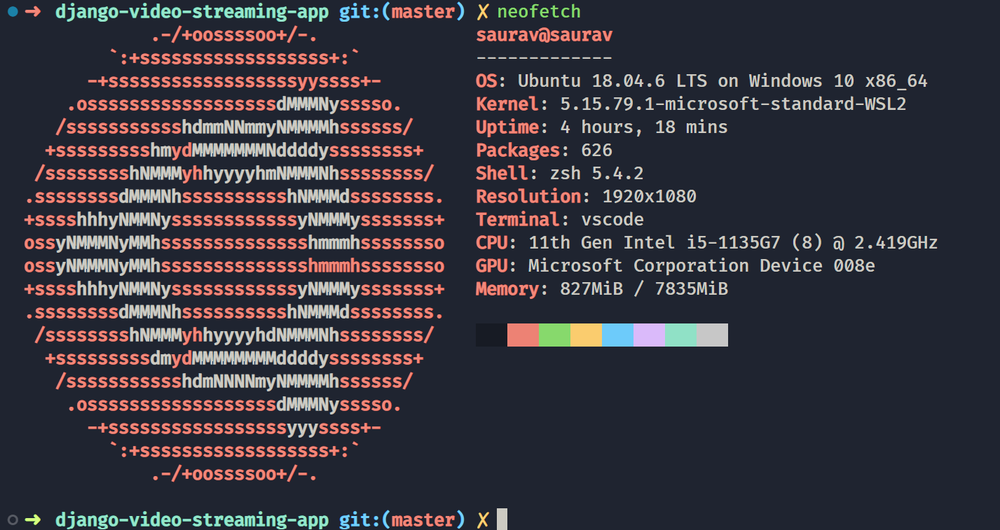
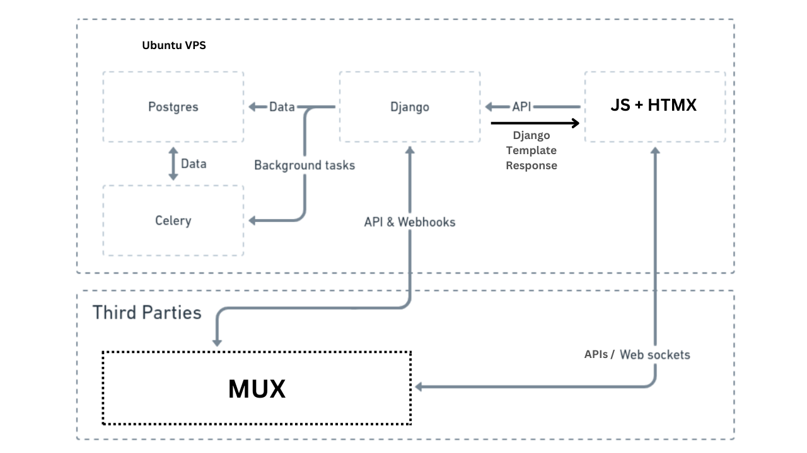

# Django Video Streaming App 📺🚀

This is a web-based video streaming app built using Django in the backend and JavaScript/HTMX in the frontend.

## 📦 Features

- Stream videos from a variety of content creators Like in YouTube.
- Search for specific videos or browse by category
- Create and share playlists with friends
- Leave comments and Likes on videos

## ⚒️ Technologies

- Django: a powerful web framework for Python that handles the backend logic and serves the frontend
- JavaScript/[HTMX](https://htmx.org/): some custom JS + HTMX - a powerful tool for building interactive web applications with minimal JavaScript
- [MUX](https://mux.com): a video streaming API that handles the streaming and playback of video content
- Ubuntu VPS/Heroku/[Render](https://render.com/): a virtual private server for hosting the app and serving the content to users
- AWS s3: a cloud storage service for hosting static files such as images and videos
- Postgres: a powerful and reliable database for storing user and app data
- Docker: a containerization platform for packaging and deploying applications in a lightweight and portable manner
- [Playwright](https://playwright.dev/): a tool for testing web applications
- [Kubernetes](https://kubernetes.io/): a powerful system for managing containerized applications at scale
- [GitHub Actions](https://docs.github.com/en/actions): a powerful CI/CD platform for automating the deployment of applications

## 🪟🐧 OS I used for development

### Windows 11 + WSL2 ( Ubuntu 18.04 )

## Project Architecture Diagram

**_📌Note:I have not included Docker & Kubernetes in architecture, since I am still learning & not sure about their all benefits. but will update this diagram, once I reach at the scaling part._**

## 🤝 Contributing

If you would like to contribute to this project, please follow the steps below:

1. Fork the repository
2. Create a new branch for your feature.
3. Commit your changes and push to the new branch.
4. Create a pull request from your branch to the `main` branch of this repository.

We welcome any contributions, big or small! Thank you for your interest in this project.
